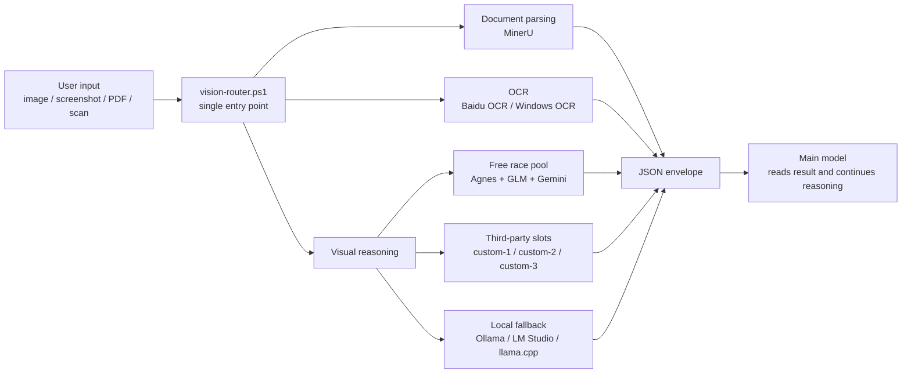
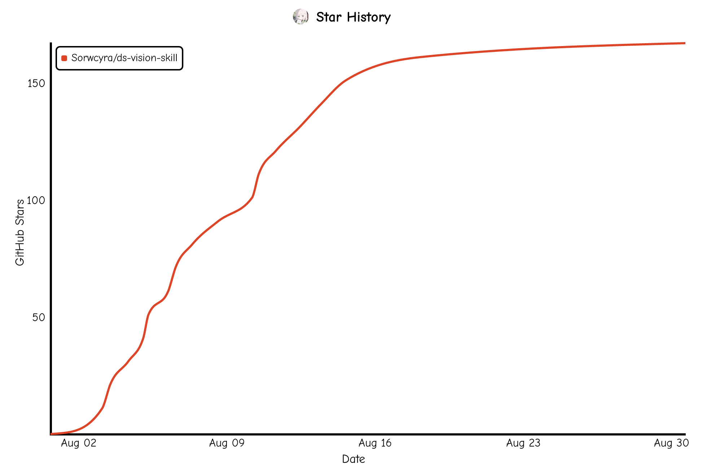

# ds-vision-skill

<p align="center">
  <strong>A fast, fallback-aware vision layer for text-first agents.</strong>
</p>

<p align="center">
  <a href="README.zh-CN.md">中文</a>
  ·
  <a href="SKILL.md">Skill spec</a>
  ·
  <a href="references/channels.md">Channels</a>
  ·
  <a href="LICENSE">License</a>
</p>

<p align="center">
  <a href="https://github.com/Sorwcyra/ds-vision-skill/stargazers"></a>
  <a href="https://github.com/Sorwcyra/ds-vision-skill/forks"></a>
  <a href="https://github.com/Sorwcyra/ds-vision-skill/commits/main"></a>
  <a href="https://github.com/Sorwcyra/ds-vision-skill/issues"></a>
  <a href="LICENSE"></a>
  <a href="VERSION"></a>
  <a href="https://github.com/Sorwcyra/ds-vision-skill"></a>
</p>

Helps text-first agents work naturally with images, screenshots, scans, PDFs, charts, UI captures, code screenshots, and math images.

It does not replace the main model. It detects the visual task, chooses the best route, races fast cloud vision channels when available, falls back through custom and local options, and returns one structured JSON envelope for the main model to reason over.

## Why It Exists

Many coding and reasoning agents are excellent with text but awkward around visual input. This skill acts as a dedicated front-end layer:

| Need | Route |
|---|---|
| Understand a screenshot, chart, UI, photo, or math image | Vision reasoning race pool |
| Extract plain text from an image or scan | Baidu OCR, then Windows OCR |
| Parse a PDF, report, paper, or multi-page document | MinerU |
| Use a private or relay model | `custom-1`, `custom-2`, `custom-3` |
| Keep sensitive work local | local runtime fallback |

## Cross-Version Speed

[](references/benchmarks.md)

Deterministic Mock benchmark, 24 measured runs per release:

| Release | Wall p50 (ms) | Wall p95 (ms) | Fanout p50 (ms) | First-ready selected |
|---|---:|---:|---:|---:|
| 0.4.1 | 3250.604 | 3466.575 | 91.021 | 91.67% |
| 0.4.2 | 1858.165 | 1948.726 | 3.130 | 91.67% |
| 0.5.0 | 1793.656 | 1859.934 | 3.188 | 100% |

Version 0.5.0 keeps all four models in the concurrent race while reducing wall p50 by 44.82% and p95 by 46.35% versus 0.4.1. See the [cross-version benchmark methodology and raw data](references/benchmarks.md). Live provider results use only 6 runs per release, vary substantially, and are reported separately.

## Quick Start

Configure the free race pool first:

These commands are safe in harnesses that default to `cmd.exe` (Zcode, some Codex/Hermes wrappers) because they call the PowerShell script through a `.cmd` launcher. Do not paste PowerShell-only syntax or `<KEY>` placeholders into `cmd.exe`; quote the real key instead.

```cmd
# GLM enables both glm and glm-thinking
scripts\setup.cmd -SetKey -Channel glm -Key "YOUR_GLM_API_KEY" -Verify

# Agnes enables both agnes-2.5-flash and agnes-2.0-flash
scripts\setup.cmd -SetKey -Channel agnes-2.5-flash -Key "YOUR_AGNES_API_KEY" -Verify

# Gemini enables gemini-3.6-flash
scripts\setup.cmd -SetKey -Channel gemini -Key "YOUR_GEMINI_API_KEY" -Verify
```

Check your environment once during setup or when diagnosing a failure. Do not run preflight before every normal analysis:

```cmd
scripts\setup.cmd -Status
powershell.exe -NoProfile -ExecutionPolicy Bypass -File scripts\preflight.ps1
```

Analyze any supported file through the single router:

```cmd
scripts\vision-router.cmd -Path "path\to\file.png" -Prompt "Analyze this file" -Json
```

Use an explicit route when the task is clear:

```cmd
scripts\vision-router.cmd -Path "path\to\image.png" -Intent ocr -Json
scripts\vision-router.cmd -Path "path\to\document.pdf" -Intent document -Json
scripts\vision-router.cmd -Path "path\to\image.png" -Intent reason -Complex -Json
scripts\vision-router.cmd -Path "path\to\image.png" -Intent reason -MaxTokens 512 -TimeoutSec 30 -Json
scripts\vision-router.cmd -Path "path\to\image.png" -Channel gemini -Json
```

`-MaxTokens` defaults to `1024` and can be lowered for shorter generations. `-TimeoutSec` defaults to `90` and caps the whole race. `-NoCache` skips both cache reads and writes.

`-Channel <name>` bypasses the race and calls exactly one channel (`glm`, `glm-thinking`, `agnes-2.5-flash`, `agnes-2.0-flash`, `gemini`, `custom-1/2/3`, or `local`); if that channel fails, the router reports the error instead of silently falling back.

## Routing Model



### Fallback Order

```text
image reasoning: race(agnes-2.5-flash, agnes-2.0-flash, glm, glm-thinking, gemini) -> custom-1 -> custom-2 -> custom-3 -> local
ocr: baidu-ocr -> windows-ocr -> vision reasoning
document: mineru flash -> mineru extract
```

All five named vision models start concurrently in each normal race (channels whose API key is missing are skipped); the first valid response wins.

In `auto` mode, image files go to visual reasoning first. Use `-Intent ocr` for OCR-only extraction, or `-AccurateOcr` for scanned and low-quality text images.

## Supported Channels

| Group | Channel | Environment | Purpose |
|---|---|---|---|
| Free race pool | `agnes-2.5-flash` | `AGNES_API_KEY` | fast OpenAI-compatible vision |
| Free race pool | `agnes-2.0-flash` | `AGNES_API_KEY` | backup fast vision |
| Free race pool | `glm` | `GLM_API_KEY` | fast GLM visual understanding |
| Free race pool | `glm-thinking` | `GLM_API_KEY` | deeper visual reasoning |
| Free race pool | `gemini` | `GEMINI_API_KEY` | Gemini 3.6 Flash vision (OpenAI-compatible) |
| Third-party slots | `custom-1` | `VISION_CUSTOM_1_*` | user-owned OpenAI-compatible model |
| Third-party slots | `custom-2` | `VISION_CUSTOM_2_*` | user-owned OpenAI-compatible model |
| Third-party slots | `custom-3` | `VISION_CUSTOM_3_*` | user-owned OpenAI-compatible model |
| OCR | `baidu-ocr` | `BAIDU_API_KEY` + `BAIDU_SECRET_KEY` | cloud OCR |
| OCR | `windows-ocr` | none | local Windows OCR |
| Document parsing | `mineru` | optional `MINERU_TOKEN` | PDF and document parsing |
| Local fallback | `local` | optional `VISION_LOCAL_MODEL` | Ollama, LM Studio, or llama.cpp |

See [references/channels.md](references/channels.md) for the full channel table.

## Third-Party Slots

Plug in any OpenAI-compatible vision endpoint:

```cmd
scripts\setup.cmd -SetCustom -Slot 1 -BaseUrl "https://example.com/v1/chat/completions" -Key "YOUR_API_KEY" -Model "YOUR_MODEL" -Verify
scripts\setup.cmd -SetCustom -Slot 2 -BaseUrl "https://example.com/v1/chat/completions" -Key "YOUR_API_KEY" -Model "YOUR_MODEL" -Verify
scripts\setup.cmd -SetCustom -Slot 3 -BaseUrl "https://example.com/v1/chat/completions" -Key "YOUR_API_KEY" -Model "YOUR_MODEL" -Verify
```

The router tries these slots only after the free race pool fails.

## JSON Contract

Every tool emits the same shape in `-Json` mode:

```json
{
  "task_type": "image_reasoning | document_parsing | ocr",
  "tool_used": "actual tool or model",
  "confidence": "high | medium | low",
  "result": "recognized, parsed, or understood content",
  "metadata": {}
}
```

The main model should read `result` first, then use `tool_used`, `confidence`, and `metadata` when it needs to explain routing or fallback behavior.

## Star History

<a href="https://www.star-history.com/?repos=Sorwcyra%2Fds-vision-skill&type=date&legend=top-left">
  
</a>

## Contributors

Contributions are welcome: bug reports, channel fixes, docs improvements, new routing strategies, and better local-model support all help.

<a href="https://github.com/Sorwcyra/ds-vision-skill/graphs/contributors">
  
</a>

Before opening a pull request:

1. Keep PowerShell source ASCII-only.
2. Keep user-facing Markdown in UTF-8.
3. Add or update routing docs when a channel changes.
4. Run the smoke or preflight checks when the change touches scripts.

```powershell
powershell.exe -NoProfile -ExecutionPolicy Bypass -File scripts\preflight.ps1
powershell.exe -NoProfile -ExecutionPolicy Bypass -File scripts\smoke-test.ps1
```

## Updates

```powershell
powershell.exe -NoProfile -ExecutionPolicy Bypass -File scripts\check-update.ps1
powershell.exe -NoProfile -ExecutionPolicy Bypass -File scripts\check-update.ps1 -Notify
powershell.exe -NoProfile -ExecutionPolicy Bypass -File scripts\update-skill.ps1
```

Installed skills are local copies. GitHub updates do not automatically update a user's local installation.

## Privacy

Cloud channels send file content to the corresponding provider. For contracts, IDs, medical material, financial files, or other sensitive content, prefer Windows OCR or a local model, or ask for confirmation before sending files to cloud services.

## License

Released under the [MIT License](LICENSE).
